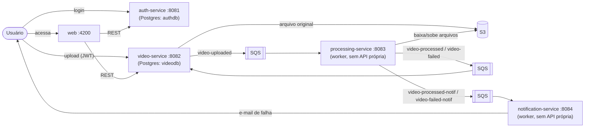
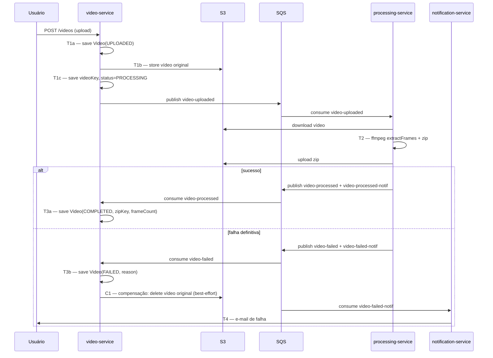

# Arquitetura do Sistema Video2Frames

Documento único de arquitetura do sistema, cobrindo o desenho de ponta a ponta, a saga coreografada entre os serviços, e as decisões de projeto. Cada serviço também tem seu próprio README com detalhes internos (camadas hexagonais, endpoints, variáveis de ambiente); este documento foca na visão do **sistema como um todo**.

## Visão geral

O Video2Frames é composto por 4 microsserviços independentes (cada um seu próprio repositório/deploy) e um frontend, coordenados por filas SQS:

| Componente | Repositório | Porta | Responsabilidade |
|---|---|---|---|
| Auth | `video2frames-auth-service` | 8081 | Cadastro, login, emissão/refresh de JWT |
| Video | `video2frames-video-service` | 8082 | API de upload, persistência de metadados/status, orquestra o início e o fim do fluxo |
| Processing | `video2frames-processing-service` | 8083 | Worker: extrai frames via ffmpeg, gera o zip |
| Notification | `video2frames-notification-service` | 8084 | Worker: notifica o usuário por e-mail em caso de falha |
| Web | `video2frames-web` | 4200 | Frontend Angular (SPA) |



Cada serviço segue **arquitetura hexagonal** (domain / application / infrastructure) internamente. Os diagramas de camadas e fluxos específicos de cada um estão no README do respectivo repositório.

## A Saga coreografada

Não existe transação distribuída nem orquestrador central: cada serviço tem seu próprio banco (ou nenhum, no caso dos workers) e a consistência entre eles é garantida por uma **saga coreografada**, em que cada serviço reage a eventos publicados por outro e, por sua vez, publica os seus. Essa escolha é deliberada. Um orquestrador central de saga adicionaria mais um componente com estado e um ponto único de falha, e o fluxo aqui é simples o suficiente (uma cadeia linear, sem passos paralelos que precisem ser sincronizados) para que a coreografia seja a opção mais fácil de operar.

### Passos (transações locais)

| Passo | Serviço | Ação | Publica |
|---|---|---|---|
| **T1** | video-service (`UploadVideoUseCase`) | Persiste `Video(UPLOADED)`, envia o arquivo original ao S3, atualiza a key, marca `PROCESSING` | `video-uploaded` |
| **T2** | processing-service (`ProcessVideoUseCase`) | Baixa do S3 → extrai frames (ffmpeg) → zipa → sobe o zip ao S3 | `video-processed` + `video-processed-notif` (sucesso) **ou** `video-failed` + `video-failed-notif` (falha) |
| **T3a** | video-service (`HandleVideoProcessedUseCase`) | Marca `Video(COMPLETED)` com `zipKey`/`frameCount` | — (fim do caminho feliz) |
| **T3b** | video-service (`HandleVideoFailedUseCase`) | Marca `Video(FAILED)` com o motivo | — |
| **T4** | notification-service (`NotifyVideoFailedUseCase`) | Envia e-mail de falha ao usuário | — (fim do caminho de erro) |

### Compensação

Quando T2 falha definitivamente, T1 precisa ser parcialmente desfeito: o arquivo original no S3 não tem mais utilidade, já que o zip nunca será gerado a partir dele. Então **T3b compensa T1** removendo esse arquivo do S3 (`VideoStoragePort.deleteOriginalVideo`, chamado por `HandleVideoFailedUseCase` logo após marcar o vídeo como `FAILED`). O registro no Postgres **não é apagado**, ele vira o rastro auditável da tentativa (status `FAILED` + motivo + histórico), que é também o que alimenta a listagem de status do usuário.



### Resiliência das filas: dead-letter queue (DLQ)

Cada uma das 5 filas SQS tem uma DLQ companion (`<fila>-dlq`) com `RedrivePolicy` (`maxReceiveCount=3`), provisionadas em `video2frames-infra-ops/localstack/init/00-init.sh`. Isso evita retry infinito de mensagens "veneno" (ex: JSON malformado, ou um consumidor que nunca consegue processar uma mensagem específica). Depois de 3 tentativas sem a mensagem ser deletada, o próprio SQS a move para a DLQ automaticamente, sem nenhuma mudança de código na aplicação, já que isso é configuração da fila, não do consumidor. Em uma migração para AWS real, o mesmo padrão se traduz diretamente em `aws_sqs_queue` + `redrive_policy` no Terraform.

### Gaps conhecidos da saga (honestidade acima de charme)

- **T1 não é atômico**: se o `save` inicial funcionar mas o upload ao S3 falhar (ou vice-versa), hoje não existe uma compensação automática para esse caso específico. O vídeo ficaria com status `UPLOADED`/`PROCESSING` sem nunca avançar. Uma mitigação futura seria um job de "vídeos travados há mais de X minutos sem evento" que os marca como `FAILED` e aciona a mesma compensação de T3b.
- **Compensação best-effort**: a remoção do arquivo original no S3 (C1) é tentada uma única vez; se falhar (S3 indisponível no momento), fica logada como órfã, mas nada tenta de novo depois. Aceitável para o escopo atual, mas um candidato natural para uma fila de compensações pendentes se o sistema crescer.

## Escalabilidade horizontal

O sistema foi desenhado para escalar em duas camadas independentes:

**1. Concorrência dentro de uma instância**: o `processing-service` processa múltiplos vídeos em paralelo num pool de threads configurável (`PROCESSING_CONCURRENCY`, padrão 4). O poller busca até 10 mensagens do SQS por ciclo e as processa concorrentemente, em vez de uma por vez, o que já é suficiente para o cenário mais comum de teste/demo (vários vídeos enviados de uma vez por um único usuário).

**2. Escala horizontal real (múltiplas réplicas)**: o `processing-service` é **stateless** (nenhum estado em memória sobrevive entre mensagens, todo arquivo temporário é único por execução) e segue o padrão **competing consumers**. Várias instâncias podem consumir a mesma fila `video-uploaded` simultaneamente sem nenhuma mudança de código, porque o próprio SQS garante que cada mensagem é entregue a apenas um consumidor por vez. É isso que torna a arquitetura escalável de verdade: basta subir mais réplicas.

```bash
docker compose -f docker-compose.yml -f docker-compose.full.yml up -d --scale processing-service=3
```

> Ressalva local: como o `docker-compose.full.yml` publica a porta `8083` fixa (para o Prometheus conseguir fazer *scrape* via `host.docker.internal:8083` e para permitir `curl` direto durante o desenvolvimento), rodar `--scale` acima de 1 réplica localmente exige remover essa publicação de porta fixa primeiro (nada além do endpoint de métricas depende dela). Em Kubernetes essa ressalva some, porque cada pod tem seu próprio IP e o Prometheus descobre os alvos dinamicamente via *service discovery* em vez de um endereço fixo. Não é uma limitação da arquitetura, é só uma simplificação do ambiente de desenvolvimento local.

## Persistência

Cada serviço com estado tem seu próprio banco (padrão *database per service*):
- `auth-service` → Postgres `authdb`, schema versionado via Flyway (`src/main/resources/db/migration`).
- `video-service` → Postgres `videodb`, schema versionado via Flyway (`src/main/resources/db/migration`).
- `processing-service` e `notification-service` não persistem nada, são workers puros: todo o estado do pipeline vive nos eventos SQS e no `video-service`.

As migrations Flyway **são** o script de criação do banco de dados versionado. Não há um `.sql` solto separado; o próprio histórico de migrations em cada repositório é a fonte da verdade.

## Cache

O `video-service` usa **Redis** para cachear a listagem de vídeos por usuário (`GET /api/videos`), a única leitura repetida do fluxo, já que o usuário tende a consultar o status do processamento várias vezes enquanto ele roda em background. A chave é `userVideos::<email>`, com TTL de 5 minutos (`spring.cache.redis.time-to-live`) como limite superior de dado desatualizado, mas cada mudança de estado (`UploadVideoUseCase`, `HandleVideoProcessedUseCase`, `HandleVideoFailedUseCase`) já invalida explicitamente a entrada do usuário correspondente na hora, então na prática o TTL raramente chega a valer. A serialização é via JDK padrão e não JSON: a serialização polimórfica de coleções genéricas via Jackson 3 no `spring-data-redis` desta versão se mostrou instável em teste, e JDK serialization acabou sendo uma alternativa mais simples e madura para este caso.

## Decisões de arquitetura

| Decisão | Alternativas consideradas | Por quê |
|---|---|---|
| Hexagonal (ports & adapters) em cada serviço | Camadas tradicionais (MVC) | Isola regra de negócio de Spring/JPA/AWS SDK, tornando os casos de uso testáveis com mocks simples e trocáveis (ex: trocar S3 por outro storage sem tocar em domínio/aplicação) |
| SQS como mensageria | RabbitMQ, Kafka | SQS é gerenciado, sem servidor pra operar, e mapeia 1:1 com o LocalStack usado em dev — reduz a distância entre o ambiente local e a futura infra AWS real. Cumpre o mesmo papel de "mensageria" pedido no desafio |
| Saga coreografada (sem orquestrador) | Orquestrador central (ex: Camunda, ou um serviço "saga-orchestrator" dedicado) | O fluxo é uma cadeia linear sem passos paralelos a coordenar; um orquestrador adicionaria um componente com estado e um ponto único de falha sem benefício real neste tamanho de sistema |
| JWT validado localmente em cada serviço (sem gateway central) | API Gateway único validando auth para todos | Mantém os serviços desacoplados (cada um decide sozinho o que autorizar) às custas de duplicar a lógica de validação de token — troca aceitável neste porte de projeto |
| Docker Compose (não Kubernetes) para o ambiente local | Kubernetes local (kind/minikube) | Compose é suficiente para provar a arquitetura (múltiplos serviços, filas, observabilidade) com muito menos fricção de setup; o desenho já é compatível com K8s depois (containers stateless, sem dependência de nomes de host fixos além do necessário) |
| Redis só no `video-service` (não um cache compartilhado entre serviços) | Cache compartilhado/centralizado | Só existe uma leitura repetida no sistema todo (listagem de vídeos); um cache compartilhado seria complexidade sem propósito — cada serviço que precisar de cache no futuro sobe (ou não) o seu, mantendo o desacoplamento entre bancos/caches por serviço |
